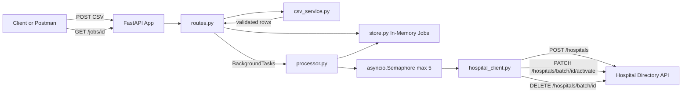
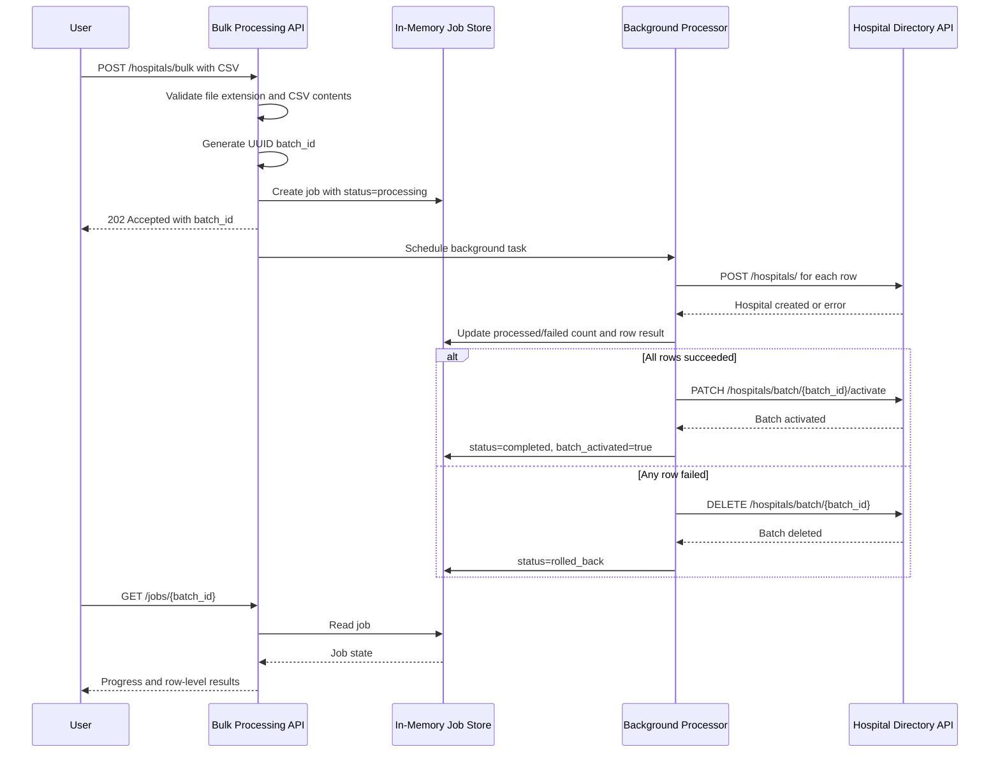

# Hospital Bulk Processing System

FastAPI service for uploading a CSV of hospitals, creating those hospitals through the deployed Hospital Directory API, and activating the batch only after every row is created successfully.

Live application:

```text
https://hospital-bulk-processor-qkd0.onrender.com
```

Swagger docs:

```text
https://hospital-bulk-processor-qkd0.onrender.com/docs
```

GitHub repository:

```text
https://github.com/gopalmani/hospital-bulk-processor
```

## Problem Summary

The provided Hospital Directory API supports individual hospital creation and batch operations. Hospitals created with a batch ID are initially inactive. After all hospitals in a batch are created successfully, the batch can be activated in one operation.

This service adds a bulk-processing API on top of that external API.

The important workflow is:

1. Accept a CSV file containing hospital rows.
2. Validate the CSV.
3. Generate a unique `batch_id`.
4. Create hospitals against the external API using that `batch_id`.
5. Track row-by-row progress.
6. Activate the batch only if every row succeeds.
7. Roll back the batch if any row permanently fails.

## Key Features

- `POST /hospitals/bulk` accepts a CSV upload and starts an async background job.
- `GET /jobs/{batch_id}` returns job status, progress, row-level results, activation state, and processing time.
- `GET /jobs` lists all known in-memory jobs.
- CSV validation requires `name,address`, allows optional `phone`, ignores empty rows, and limits uploads to 20 hospitals.
- External API calls retry transient failures up to 3 times with `1s`, `2s`, and `4s` backoff.
- Hospital creation is limited to 5 concurrent external API calls.
- If any row fails permanently, the service rolls back the batch using `DELETE /hospitals/batch/{batch_id}`.
- Structured logs are emitted for job acceptance, row success/failure, retries, activation, rollback, and job completion.
- Tests mock the external Hospital Directory API so the test suite is deterministic and does not depend on network access.

## High-Level Architecture



### Architecture Explanation

The client uploads a CSV to the FastAPI service. The route validates the file and immediately creates a job record in memory. The actual hospital creation work is then scheduled as a background task, so the upload request does not wait for all external API calls to finish.

The processor creates hospitals concurrently but limits external calls with a semaphore. Each completed row updates the in-memory job store. When all rows finish, the processor either activates the batch or rolls it back.

The client can poll `GET /jobs/{batch_id}` to see progress and final results.

## Request Lifecycle



## Component Responsibilities

### `app/routes.py`

Defines API endpoints only.

- Validates the uploaded file is a CSV.
- Calls `parse_csv`.
- Creates the job record.
- Schedules background processing.
- Returns job status endpoints.

Main endpoints:

- `POST /hospitals/bulk`
- `GET /jobs/{batch_id}`
- `GET /jobs`

### `app/csv_service.py`

Handles CSV parsing and validation.

Validation rules:

- Required columns: `name`, `address`
- Optional column: `phone`
- Empty rows are ignored
- Maximum rows: `20`
- Empty `name` or `address` fails validation
- CSV must be UTF-8 compatible

### `app/processor.py`

Owns background job orchestration.

Responsibilities:

- Process all rows in the background.
- Limit concurrent hospital creation calls to 5.
- Update job progress after each row completes.
- Activate the batch if all rows succeed.
- Roll back the batch if any row fails.
- Record final processing time.
- Emit logs for processing milestones.

### `app/hospital_client.py`

Owns integration with the external Hospital Directory API.

Responsibilities:

- `POST /hospitals/`
- `PATCH /hospitals/batch/{batch_id}/activate`
- `DELETE /hospitals/batch/{batch_id}`
- Retry transient failures.

Retryable failures:

- Timeout errors
- Connection errors
- HTTP `429`
- HTTP `5xx`

Non-retryable failures:

- HTTP `400`
- HTTP `401`
- HTTP `403`
- HTTP `404`
- Any other client-side validation error

### `app/store.py`

In-memory job state store.

Responsibilities:

- Create a job.
- Fetch one job.
- List all jobs.
- Add row results.
- Update job status.
- Mark a batch activated.

This uses an `asyncio.Lock` so updates are safer while multiple async row tasks complete.

### `app/models.py`

Pydantic schemas for request/response and internal state.

Important models:

- `HospitalCSVRow`
- `HospitalResult`
- `JobStatus`
- `BulkUploadResponse`

### `app/config.py`

Central configuration.

```python
BASE_URL = "https://hospital-directory.onrender.com"
MAX_HOSPITALS = 20
CONCURRENT_REQUESTS = 5
REQUEST_TIMEOUT = 20
```

## API Reference

### Start Bulk Upload

```http
POST /hospitals/bulk
Content-Type: multipart/form-data
```

Form field:

```text
file: hospitals.csv
```

Example response:

```json
{
  "batch_id": "550e8400-e29b-41d4-a716-446655440000",
  "status": "processing",
  "message": "Bulk job accepted"
}
```

Why `202 Accepted`?

The request has been accepted, but the actual processing continues in the background. This avoids holding the HTTP request open while external API calls run.

### Get Job Status

```http
GET /jobs/{batch_id}
```

Example response while processing:

```json
{
  "batch_id": "550e8400-e29b-41d4-a716-446655440000",
  "status": "processing",
  "total_hospitals": 3,
  "processed_hospitals": 1,
  "failed_hospitals": 0,
  "batch_activated": false,
  "processing_time_seconds": null,
  "hospitals": [
    {
      "row": 1,
      "hospital_id": 101,
      "name": "ABC Hospital",
      "status": "created",
      "error": null
    }
  ]
}
```

Example response after success:

```json
{
  "batch_id": "550e8400-e29b-41d4-a716-446655440000",
  "status": "completed",
  "total_hospitals": 3,
  "processed_hospitals": 3,
  "failed_hospitals": 0,
  "batch_activated": true,
  "processing_time_seconds": 1.42,
  "hospitals": [
    {
      "row": 1,
      "hospital_id": 101,
      "name": "ABC Hospital",
      "status": "created_and_activated",
      "error": null
    }
  ]
}
```

Example response after rollback:

```json
{
  "batch_id": "550e8400-e29b-41d4-a716-446655440000",
  "status": "rolled_back",
  "total_hospitals": 2,
  "processed_hospitals": 2,
  "failed_hospitals": 1,
  "batch_activated": false,
  "processing_time_seconds": 4.18,
  "hospitals": [
    {
      "row": 1,
      "hospital_id": 101,
      "name": "Good Hospital",
      "status": "created",
      "error": null
    },
    {
      "row": 2,
      "hospital_id": null,
      "name": "Bad Hospital",
      "status": "failed",
      "error": "timeout"
    }
  ]
}
```

### List All Jobs

```http
GET /jobs
```

Returns:

```json
[
  {
    "batch_id": "550e8400-e29b-41d4-a716-446655440000",
    "status": "completed",
    "total_hospitals": 3,
    "processed_hospitals": 3,
    "failed_hospitals": 0,
    "batch_activated": true,
    "processing_time_seconds": 1.42,
    "hospitals": []
  }
]
```

## CSV Format

Required columns:

```text
name,address
```

Optional column:

```text
phone
```

Example:

```csv
name,address,phone
ABC Hospital,123 Main Street,555-1001
City Care Clinic,45 Park Avenue,555-1002
Sunrise Medical Center,88 Lake Road,
```

Invalid examples:

Missing `address` column:

```csv
name,phone
ABC Hospital,555-1001
```

Missing required value:

```csv
name,address,phone
ABC Hospital,,555-1001
```

Too many rows:

```text
More than 20 hospital rows
```

## Reliability Design

### Retry Logic

External API calls are retried for transient failures only.

Retry attempts:

```text
Initial attempt + 3 retries = up to 4 total attempts
```

Backoff schedule:

```text
1 second, 2 seconds, 4 seconds
```

Why retry these errors?

- Timeout: The external service may be slow.
- Connection error: Network issue may be temporary.
- `429`: Rate limit may clear after waiting.
- `5xx`: Server-side problem may recover.

Why not retry `400`?

`400` usually means the request payload is invalid. Retrying the same invalid payload would not help.

### Concurrency Control

The processor uses:

```python
asyncio.Semaphore(CONCURRENT_REQUESTS)
```

Current limit:

```text
5 concurrent hospital creation calls
```

Why limit concurrency?

- Avoid overwhelming the external API.
- Reduce rate-limit risk.
- Keep resource usage predictable.
- Still process faster than purely sequential execution.

### Rollback Safety

If any hospital row permanently fails:

1. The row is marked as failed.
2. The job records the failure.
3. The processor calls `DELETE /hospitals/batch/{batch_id}`.
4. The final job status becomes `rolled_back` if rollback succeeds.
5. If rollback itself fails, the final job status becomes `failed`.

This prevents a partially created inactive batch from remaining in the external system.

### Batch Activation

The service only calls:

```text
PATCH /hospitals/batch/{batch_id}/activate
```

after every row has been created successfully.

That means users do not see a partially active batch.

## Logging

The app emits structured log-style messages with context using Python logging.

Important events:

- `job_accepted`
- `csv_parsed`
- `bulk_job_started`
- `bulk_row_success`
- `bulk_row_failure`
- `external_api_call_retrying`
- `external_api_call_failed`
- `batch_activation_success`
- `batch_activation_failed`
- `rollback_executed`
- `rollback_failed`
- `bulk_job_finished`

Example log event:

```text
bulk_row_success batch_id=... row=1 hospital_name="ABC Hospital" hospital_id=101
```

## Status Values

Jobs can have the following statuses:

```text
processing
completed
failed
rolled_back
```

Meaning:

- `processing`: Background job is still running.
- `completed`: All hospitals were created and the batch was activated.
- `rolled_back`: At least one row failed and the batch was deleted.
- `failed`: A serious failure happened, such as rollback failure.

## Run Locally

Create and activate a virtual environment:

```bash
python3 -m venv .venv
.venv/bin/python -m pip install -r requirements.txt
```

Run the API:

```bash
.venv/bin/uvicorn app.main:app --reload
```

Open API docs:

```text
http://localhost:8000/docs
```

## Curl Examples

Start a bulk job:

```bash
curl -X POST http://localhost:8000/hospitals/bulk \
  -F "file=@hospitals.csv"
```

Check one job:

```bash
curl http://localhost:8000/jobs/{batch_id}
```

List jobs:

```bash
curl http://localhost:8000/jobs
```

Against the deployed Render service:

```bash
curl https://hospital-bulk-processor-qkd0.onrender.com/jobs
```

```bash
curl -X POST https://hospital-bulk-processor-qkd0.onrender.com/hospitals/bulk \
  -F "file=@hospitals.csv"
```

## Tests

Run:

```bash
.venv/bin/python -m pytest -q
```

Current coverage includes:

- Valid CSV upload returns `202`.
- Invalid CSV returns `400`.
- Unknown batch returns `404`.
- Successful job flow activates the batch.
- Failed row triggers rollback.
- Retry logic retries timeout failures.
- Retry logic does not retry `400` failures.

The tests mock the external API integration so they are fast, stable, and do not depend on the deployed Hospital Directory API.

## Docker

Build:

```bash
docker build -t hospital-bulk-processor .
```

Run:

```bash
docker run -p 10000:10000 -e PORT=10000 hospital-bulk-processor
```

Then open:

```text
http://localhost:10000/docs
```

## Deploy To Render

Use a Render Web Service with:

```text
Runtime: Python 3
Build Command: pip install -r requirements.txt
Start Command: uvicorn app.main:app --host 0.0.0.0 --port $PORT
```

The included Dockerfile also respects Render's `PORT` environment variable.

Render free-tier note:

```text
The first request after inactivity may be slow because free Render services can spin down.
```

## Design Decisions

### Why Return `202 Accepted`?

The original operation requires multiple external API calls. Blocking the upload request until every row finishes can lead to slow responses and timeout risk.

Returning `202 Accepted` means:

- The upload was accepted.
- Processing continues in the background.
- The client can poll for progress.
- The API behaves more like a production bulk-processing system.

### Why In-Memory Storage?

The assignment allows in-memory storage, and it keeps the solution simple.

Tradeoff:

- Easy to understand and run.
- No database setup required.
- Job history disappears when the server restarts.

Production alternative:

- Redis for short-lived job state.
- Postgres for durable job and audit history.
- A queue system such as Celery, RQ, Dramatiq, SQS, or Cloud Tasks for durable background processing.

### Why FastAPI BackgroundTasks?

FastAPI `BackgroundTasks` is simple and appropriate for a take-home assignment with small CSV files.

Production limitation:

- Tasks are not durable.
- If the process restarts, in-flight work is lost.
- Multiple server instances would not share the same in-memory job store.

Production alternative:

- Use a real job queue and persistent job store.

## Failure Scenarios

| Scenario | Behavior |
| --- | --- |
| Invalid CSV | Return `400` with friendly error |
| Unknown job ID | Return `404` |
| One row fails permanently | Mark row failed, delete batch, status `rolled_back` |
| Activation fails | Delete batch, status `rolled_back` if rollback succeeds |
| Rollback fails | Status `failed` |
| External API timeout | Retry with backoff |
| External API `429` or `5xx` | Retry with backoff |
| External API `400` | Do not retry |

## Interview Study Notes

### Walkthrough Answer

```text
The upload endpoint validates the CSV and creates a UUID batch job immediately. It returns 202 Accepted so the client is not blocked while external API calls run. The actual processing happens in a background task. The processor creates hospitals concurrently with a semaphore limit of 5, updates in-memory job progress after each row, retries transient external failures, and only activates the batch if every row succeeds. If any row permanently fails, it calls the batch delete endpoint to roll back partial state. The client can poll GET /jobs/{batch_id} for progress and final results.
```

### Questions To Prepare

- Why did you choose async background processing?
- Why is `202 Accepted` better than waiting synchronously?
- Why use a UUID for `batch_id`?
- Why activate only after all rows succeed?
- What happens if a row fails?
- What happens if activation fails?
- What happens if rollback fails?
- Why retry only timeout, connection errors, `429`, and `5xx`?
- Why not retry `400`?
- Why limit concurrency?
- What are the limitations of in-memory storage?
- What would you change for production?
- How would you scale this to thousands of rows?
- How would you make background jobs durable?
- How would you add authentication or rate limiting?

### Strong Production Improvements

- Move job state from memory to Redis or Postgres.
- Use a durable queue like Celery, RQ, Dramatiq, SQS, or Cloud Tasks.
- Add idempotency keys to prevent duplicate processing.
- Store uploaded CSV metadata for auditing.
- Add authentication and authorization.
- Add request size limits.
- Add JSON structured logging.
- Add metrics, tracing, and alerting.
- Add integration tests with a mock HTTP server.
- Make `BASE_URL`, retry counts, timeout, and concurrency configurable through environment variables.

## Project Structure

```text
hospital-bulk-processor/
  app/
    main.py
    config.py
    models.py
    store.py
    hospital_client.py
    csv_service.py
    processor.py
    routes.py
  tests/
    test_bulk.py
  Dockerfile
  requirements.txt
  README.md
```

## Final Notes

This implementation is intentionally simple but production-minded. It avoids Celery or Redis because the assignment allows in-memory state and limits CSV uploads to 20 hospitals. The design still demonstrates the core backend concepts: async APIs, background work, integration retries, concurrency control, rollback safety, progress tracking, logging, testing, and deployment.
